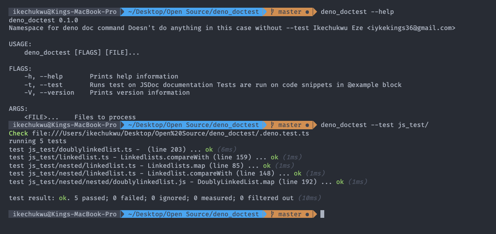

# deno_doctest

Proposal on how deno doctest will work

- Currently: It can
- Extract JsDoc comments
- Extract @example section from it
- Extract caption
- Extract the code in the @example section within opening and closing three backticks
- Extract import statements and remove duplicate imports across tests
- Extract line number of the @example section
- Support multiple examples in one block
- doc can be ignored from testing, by adding ignore to the opening three backticks (eg. ```ignore)
- doc can be skipped from testing, by adding text to the opening three backticks (eg. ```text)
- If doc contains `await` keyword, generated test will be automatically wrapped with async fn

## To use

- Install

  `cargo install --path .`

- Run

  `deno_doctest --test <File|Dir>[]`

  eg.
  `deno_doctest --test js_test/nested js_test/linkedlist.ts`

## Notes

- In Deno reading files is done using deno_core::ModuleSpecifier but here std::file::read_to_string is used for testing

## Test

`cargo test`

## Example


